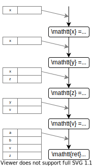
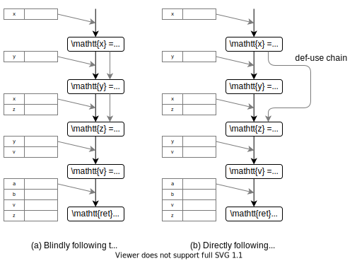

# Introduction to static analysis #5

## Seminar @ Gondow Lab.

<!--
class: title
-->

---

<!--
class: slides
_footer: ''
paginate: true
-->

<!-- TODO : needs to be updated -->

# Overview

- Sparse Analysis
  - Spatial Sparsity
  - Temporal Sparsity
- Modular Analysis
- Backward Analysis

---

# Sparse Analysis (1/2)

We can reduce the cost of the analysis by considering ***sparsity***.

- Spatial sparsity
- Temporal sparsity

By exploiting these, we can improve the scalability of the analysis ( we call this ***sparse analysis*** ).

---

# Sparse Analysis (2/2)

Sparse analysis is independent of its underlying analysis.
That is,
1. Design a sound analysis
2. Add sparse analysis to improve its scalability
  - its precision is preserved

---

# What is spatial sparsity ?

We will consider this c-like program.

```c
x = x + 1;
y = y - 1;
z = x;
v = y;
ret *a + *b;
```

---

# What is spatial sparsity ?

<!-- figure 5.9を用いてSpatial Sparsityの導入をする -->

  

We need only <red>red</red> part.

---

# Spatial Sparsity

Notation:
- $dom(M^{\sharp})$ : $\mathbb{M}^{\sharp} \rightarrow \wp (\mathbb{A^{\sharp}})$ 
  - entries of $M^{\sharp}$
- $Access^{\sharp}(l)$ : $\mathbb{L} \rightarrow \wp (\mathbb{A^{\sharp}})$
  - set of abstract locations that may be accessed by the program in label $l$


---

# Spatial Sparsity

The abstract semantics function
$$F^{\sharp} : (\mathbb{L} \rightarrow \mathbb{M}^{\sharp}) \rightarrow (\mathbb{L} \rightarrow \mathbb{M}^{\sharp})$$
becomes
$$F^{\sharp}_{sparse} : (\mathbb{L} \rightarrow \mathbb{M}^{\sharp}_{sparse}) \rightarrow (\mathbb{L} \rightarrow \mathbb{M}^{\sharp}_{sparse})$$
where
$$\mathbb{M}^{\sharp}_{sparse} = \{ M^{\sharp} \in \mathbb{M}^{\sharp} \enspace | \enspace dom(M^{\sharp}) = Access^{\sharp}(l), l \in \mathbb{L} \} \cup \{ \bot \}$$

<note>

- $\mathbb{M}^{\sharp}_{sparse}$ : メモリ状態から、アクセスされ得ないものを削除したもの
</note>

---

# Spatial Sparsity

Then, when $Access^{\sharp}(\cdot)$ is computed?
- → before the main analysis starts ( so called *pre-analysis* )
  - pre-analysis : typically coarser, hence quicker yet sound analysis

---

# Overview

- Sparse Analysis
  - Spatial Sparsity
  - Temporal Sparsity
- Modular Analysis
- Backward Analysis

---

# Temporal Sparsity



- I show only the case of $\mathrm{x}$.

- Statements where defined variables are not used can be skipped.
  - in this case the second statement
- Such flow is called ***def-use chain***

---

# Temporal Sparsity

Once the def-use chain is available, temporal sparsity analysis is defined as follow:

$$(l, M^{\sharp}) \hookrightarrow^{\sharp} (l\rq, M\rq^{\sharp}) \enspace \mathrm{for} \enspace l\rq \in \mathtt{next}^{\sharp} (l, M^{\sharp})$$

Then, $\hookrightarrow^{\sharp}$ become sparse.

$\mathtt{next}^{\sharp}(l, M^{\sharp})$ determines the def-use relation from where point $l$ to its use point $l\rq$.

---

# Precision-Preserving Def-Use Chain

<def>

<h4>
Definition 5.4 (Safe def and use sets from pre-analysis)
</h4>

  - $D^{\sharp}(l)$ :  sets of abstract locations
  - $U^{\sharp}(l)$ :  sets of abstract locations

  $D^{\sharp}_{pre}$ and $U^{\sharp}_{pre}$ are those that are computed by the pre-analysis.

  - $D^{\sharp}_{pre}$ and $U^{\sharp}_{pre}$ are *safe* whenever
    - $\forall l \in \mathbb{L} : D^{\sharp}_{pre} (l) \supseteq D^{\sharp}(l) \enspace$ and $\enspace \forall l \in \mathbb{L} : U^{\sharp}_{pre} (l) \supseteq U^{\sharp}(l)$
      - over-approximate non-sparse analysis
    - $\forall l \in \mathbb{L} : U^{\sharp}_{pre} (l) \supseteq D^{\sharp}_{pre} (l) \enspace \backslash \enspace D^{\sharp}(l)$
      - this will be explained later

</def>

---

# Precision-Preserving Def-Use Chain

<def>

<h4>
Definition 5.5 (Def-use chain information from pre-analysis)
</h4>

  We define $D^{\sharp}_{pre}$ and $U^{\sharp}_{pre}$ as in definition 5.4.

  - label $a$ and $b$ have a *def-use chain* for abstract location $\eta$ whenever
    - for every label $c$ in the execution paths from $a$ to $b$
      - $\eta \notin D^{\sharp}_{pre}(c)$

</def>


---

# Precision-Preserving Def-Use Chain

- Why is the second condition in <u>def 5.4</u> needed to be safe?
> - $\forall l \in \mathbb{L} : U^{\sharp}_{pre} \supseteq D^{\sharp}_{pre} (l) D^{\sharp}(l)$

- → To preserve the original flow.


---

# Overview

- Sparse Analysis
- Modular Analysis
  - Introduction
  - Case study
- Backward Analysis

---

# Modular Analysis

- Unit of modular analysis : procedure (function)
- analyze each of them, and then, links them together and get the whole-program analysis result.

merit:
- incremental analysis
- improvement of precision
- you have to recompute only the analysis of a procedure when it is modified.

---

# Parameterization

Consider a interval analysis $[l, h]$.

1. parameterize the calling context
   - in this case symbolize the lower and upper bound of interval
1. compute the post-state in terms of symbolic parameters
1. at link time, instantiate pre- and post-state
1. ex) check whether the no-buffer-overrun conditions are violated

---

# Summary-Based

> When we resolve the symbolic safe conditions to be violated, an alarm is raised.

---

# Scalability

- When a procedure is modified:
  - the whole-program analysis result is quickly obtained by updating only the result of modified condition.
- Scalability is maintained.

---

# Overview

- Sparse Analysis
- Modular Analysis
  - Introduction
  - Case study
- Backward Analysis

---

# Case Study (1/3)

Goal:
- estimate the sizes of buffers and the ranges of their indexing expressions

Fist example:
```c
void set_i(int *arr, int index) {
  arr[index] = 0;
}
```

Parametric context is:
$$
\begin{align*}
\mathtt{arr} &\mapsto (\mathrm{offset} : [\mathtt{s}_0, \mathtt{s}_1], \mathrm{size} : [\mathtt{s}_2, \mathtt{s}_3])\\
\mathtt{index} &\mapsto [\mathtt{s}_4, \mathtt{s}_5]
\end{align*}
$$

Safe condition is:
$$
[\mathtt{s}_0 + \mathtt{s}_4, \mathtt{s}_1 + \mathtt{s}_5] < [\mathtt{s}_2, \mathtt{s}_3]
$$

---

# Case Study (2/3)

Second example

```c
char * malloc_wrapper(int n) {
  return malloc(n);
}
```

Symbolic procedure summary would be:
$$
\begin{align*}
\mathtt{n} &\mapsto [\mathtt{s}_6, \mathtt{s}_7]\\
\mathtt{ret} &\mapsto (\mathrm{offset} : [0, 0], \mathrm{size} : [\mathtt{s}_6, \mathtt{s}_7])
\end{align*}
$$

---

# Case Study (3/3)

```c
void interprocedural() {
  int *arr = malloc_wrapper(9*sizeof(int));
  // arr -> (offset:[0,0], size:[9,9])
  int i;
  for ( i = 0; i < 9; i+=1 ) {
    // i -> [0,8]
    set_i(arr, i);      // safe
    set_i(arr, i + 1);  // alarm
  }
}
```

For the first $\mathtt{set\_i}(\mathtt{arr}, \mathtt{i})$ call, the safety condition is:
$$
[0 + 0, 0 + 8] < [9, 9]
$$

For the second $\mathtt{set\_i}(\mathtt{arr}, \mathtt{i} + 1)$ call, the safety condition is:
$$
[0 + 0, 0 + 9] < [9, 9]
$$
This condition is false, hence alarm.

---

# Overview

- Sparse Analysis
- Modular Analysis
- Backward Analysis
  - introduction
  - precise refinement

---

# Forward vs Backward

Let's over-approximate pre-condition from a post-condition.

Recall the filtering function $\mathscr{F}_{\mathtt{B}}$ from chapter 3,
$$
\mathscr{F}_{\mathtt{B}} (M) = \{ m \in M \enspace | \enspace \llbracket \mathtt{B} \rrbracket (m) = \mathtt{true}\}
$$

We can define $\llbracket B \rrbracket _{\mathbf{bwd}}$ and define $\mathscr{F}_{\mathtt{B}}$ from it:
$$
\begin{align*}
\llbracket \mathtt{B} \rrbracket_{\mathbf{bwd}} (v) &= \{ m \in \mathbb{M} \enspace | \enspace \llbracket \mathtt{B} \rrbracket (m) = v \}\\
\mathscr{F}_{\mathtt{B}} (M) &= M \cap \llbracket B \rrbracket_{\mathbf{bwd}} (\mathtt{true})
\end{align*}
$$

- $\llbracket \mathtt{B} \rrbracket_{\mathbf{bwd}}$ is backward style.
  - input : value
  - output : set of states that lead to the input value

---

# Forward vs Backward

We define backward semantics as follow:
$$
\begin{align*}
\llbracket C \rrbracket_{\mathbf{bwd}} (M) &= \{ m \in \mathbb{M} \enspace | \enspace \exists m \rq \in \llbracket C \rrbracket (\{ m\}), m\rq \in M \} \\
&= \{ m \in \mathbb{M} \enspace | \enspace \llbracket C \rrbracket (\{ m \}) \cap M \not = \empty \}
\end{align*}
$$

Intuitive explanation
- input : a set of states $M$
- output : a set of states that may lead to some of $M$ by executing $C$

---

# Backward analysis and Applications (1/4)

```c
int x0, x1;
input(x0);
if (x0 > 0) {
  x1 := x0;
} else {
  x1 := -x0;
}
```

<details>
<summary>

Q. The result of the analysis of chapter 3 is: ($\{\mathrm{x}_0 \mapsto ??, \mathrm{x}_1 \mapsto ??\}$)
</summary>

$$
\{\mathrm{x}_0 \mapsto \top , \mathrm{x}_1 \mapsto [0, +\infty)\}
$$

</details>

---

# Backward analysis and Applications (2/4)

```c
int x0, x1;
input(x0);
if (x0 > 0) {
  x1 := x0;
} else {
  x1 := -x0;
}
```

<details>
<summary>

Q. $\llbracket C \rrbracket_{\mathbf{bwd}}$ maps $2 \leq \mathrm{x}_1 \leq 5$ to ...
</summary>

$$
\begin{align*}
\mathrm{x}_0 &: [-5, -2] \cup [2, 5], \mathrm{or}\\
\mathrm{x}_0 &: [-5, 5] \text{ ( still sound )}
\end{align*}
$$

</details>

---

# Backward analysis and Applications (3/4)

```c
int x0, x1;
input(x0);
if (x0 > 0) {
  x1 := x0;
} else {
  x1 := -x0;
}
```

<details>
<summary>

Q. $\llbracket C \rrbracket_{\mathbf{bwd}}$ maps $\mathrm{x}_1 \leq -3$ to ...
</summary>

$$
\mathrm{x}_1 : \bot \text{ ( infeasible ) }
$$

</details>

---

# Backward analysis and Applications (4/4)

- Provide *necessary condition* for a specific behavior to occur
  - = provide *sufficient condition* for a specific behavior not to occur
- Program understanding
- Precision Refinement

---

# Definition of Backward Analysis (1/2)

- $\llbracket \mathbf{skip} \rrbracket_{\mathbf{bwd}}^{\sharp} (M^{\sharp}) = M^{\sharp}$
- $\llbracket C_0;C_1 \rrbracket_{\mathbf{bwd}}^{\sharp} (M^{\sharp}) = M^{\sharp}$
- $\llbracket \mathbf{if}(B)\{C_0\}\mathbf{else}\{C_1\} \rrbracket_{\mathbf{bwd}}^{\sharp} (M^{\sharp}) = \mathscr{F}_{B}^{\sharp}(\llbracket C_0 \rrbracket_{\mathbf{bwd}}^{\sharp}) \sqcup^{\sharp} \mathscr{F}_{\neg B}^{\sharp}(\llbracket C_1 \rrbracket_{\mathbf{bwd}}^{\sharp})$
- $\llbracket \mathbf{while}(B)\{C\} \rrbracket_{\mathbf{bwd}}^{\sharp}(M^{\sharp}) = \mathtt{abs\_iter}(\mathscr{F}_{B}^{\sharp}\circ\llbracket C \rrbracket_{\mathbf{bwd}}^{\sharp}) \circ \mathscr{F}_{\neg B} (M^{\sharp})$

---

# Definition of Backward Analysis (2/2)

- expression $\mathtt{x} \colonequals \mathtt{E}$
  - if $\mathtt{x}$ appears in $\mathtt{E}$ ( "non-invertible" )
    - apply $\mathscr{F}^{\sharp}_{\mathtt{x} = \mathtt{E}}$ and then forget all the constraints over $\mathtt{x}$
  - if $\mathtt{x}$ does not appears in $\mathtt{E}$ ( "invertible" )
    - such as $\mathtt{x} = \mathtt{x} + 1$
    - derive pre-condition from post-condition
      - post-condition : $\{\mathtt{x} \mapsto [3, 9]\}$
      - pre-condition : $\{\mathtt{x} \mapsto [2, 8]\}$

---

# Precision Refinement

```c
...
# 1
if (y <= x) {
  ...  
  # 2
    if (x <= 4) {
      ...
      # 3
        if (5 <= y){
          ...
          # 4
        }
    }
}
```

Note:
- third true branch is not *feasible*

---

# Precision Refinement (1/3)

Forward analysis using intervals or polyhedra.
<div class="twocols">
  <p>

Intervals
1. $\{\mathtt{x} \mapsto \top, \mathtt{y} \mapsto \top\}$
1. $\{\mathtt{x} \mapsto \top, \mathtt{y} \mapsto \top\}$
1. $\{\mathtt{x} \mapsto (- \infty , 4], \mathtt{y} \mapsto \top\}$
1. $\{\mathtt{x} \mapsto (- \infty , 4], \mathtt{y} \mapsto [5, +\infty]\}$
  </p>

  <p class="break">

Polyhedra
1. $\top$
1. $\mathtt{y} \leq \mathtt{x}$
1. $\mathtt{y} \leq \mathtt{x} \land \mathtt{x} \leq 4$
1. $\bot$
  </p>
</div>

Result:
- Analysis using polyhedra suggests that the third true branch is not feasible,
  - but the analysis using intervals does not

---

# Precision Refinement (2/3)

Backward analysis using the result of fist forward analysis:
1. $\bot$ ↑ end
1. $\{\mathtt{x} \mapsto (- \infty , 4], \mathtt{y} \mapsto [5, + \infty)\}$ ↑
1. $\{\mathtt{x} \mapsto (- \infty , 4], \mathtt{y} \mapsto [5, + \infty)\}$ ↑
1. $\{\mathtt{x} \mapsto (- \infty , 4], \mathtt{y} \mapsto [5, + \infty)\}$ ↑ start

Again, forward analysis
1. $\bot$ ↓ start
1. $\bot$ ↓
1. $\bot$ ↓
1. $\bot$ ↓ end, not feasible

---

# Precision Refinement (3/3)

- This forward-backward iteration can be iterated as many times as required
- Backward analysis itself might be imprecise,
  - however, it can improve preciseness used with forward analysis.
