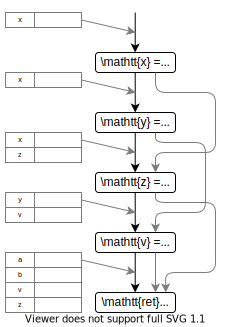

# Introduction to static analysis #5

## Seminar @ Gondow Lab.

<!--
class: title
-->

---

<!--
class: slides
_footer: ''
paginate: true
-->

<!-- TODO : needs to be updated -->

# Overview

- Sparse Analysis
  - Spatial Sparsity
  - Temporal Sparsity
- Modular Analysis
- Backward Analysis

---

# Sparse Analysis (1/n)

We can reduce the cost of the analysis by considering ***sparsity***.

- Spatial sparsity
- Temporal sparsity

By exploiting these, we can improve the scalability of the analysis ( we call this ***sparse analysis*** ).

---

# Sparse Analysis (2/2)

Sparse analysis is independent of its underlying analysis.
That is,
1. Design a sound analysis
2. Add sparse analysis to improve its scalability
  - its precision is preserved

---

# What is spatial sparsity ?

We will consider this c-like program.

```c
x = x + 1;
y = y - 1;
z = x;
v = y;
ret *a + *b;
```

---

# What is spatial sparsity ?

<!-- figure 5.9を用いてSpatial Sparsityの導入をする -->

  

We need only <red>red</red> part.

---

# Spatial Sparsity

Notation:
- $dom(M^{\sharp})$ : $\mathbb{M}^{\sharp} \rightarrow \wp (\mathbb{X})$ 
  - entries of $M^{\sharp}$
- $Access^{\sharp}(l)$ : $\mathbb{L} \rightarrow \wp (\mathbb{X})$
  - set of abstract locations that may be accessed by the program in label $l$


---

# Spatial Sparsity

The abstract semantics function
$$F^{\sharp} : (\mathbb{L} \rightarrow \mathbb{M}^{\sharp}) \rightarrow (\mathbb{L} \rightarrow \mathbb{M}^{\sharp})$$
becomes
$$F^{\sharp}_{sparse} : (\mathbb{L} \rightarrow \mathbb{M}^{\sharp}_{sparse}) \rightarrow (\mathbb{L} \rightarrow \mathbb{M}^{\sharp}_{sparse})$$
where
$$\mathbb{M}^{\sharp}_{sparse} = \{ M^{\sharp} \in \mathbb{M}^{\sharp} \enspace | \enspace dom(M^{\sharp}) = Access^{\sharp}(l), l \in \mathbb{L} \} \cup \{ \bot \}$$

<note>

- $\mathbb{M}^{\sharp}_{sparse}$ : メモリ状態から、アクセスされ得ないものを削除したもの
</note>

---

# Spatial Sparsity

Then, when $Access^{\sharp}(\cdot)$ is computed?
- → before the main analysis starts ( so called *pre-analysis* )
  - pre-analysis : typically coarser, hence quicker yet sound analysis

---

# Temporal Sparsity



---

# Precision-Preserving Def-Use Chain

<def>

<h4>
Definition 5.4 (Safe def and use sets from pre-analysis)
</h4>

  - $D^{\sharp}(l)$ :  sets of abstract locations
  - $U^{\sharp}(l)$ :  sets of abstract locations

  $D^{\sharp}_{pre}$ and $U^{\sharp}_{pre}$ are those that are computed by the pre-analysis.

  - $D^{\sharp}_{pre}$ and $U^{\sharp}_{pre}$ are *safe* whenever
    - $\forall l \in \mathbb{L} : D^{\sharp}_{pre} (l) \supseteq D^{\sharp}(l) \enspace$ and $\enspace \forall l \in \mathbb{L} : U^{\sharp}_{pre} (l) \supseteq U^{\sharp}(l)$
      - over-approximate non-sparse analysis
    - $\forall l \in \mathbb{L} : U^{\sharp}_{pre} \supseteq D^{\sharp}_{pre} (l) \enspace \backslash \enspace D^{\sharp}(l)$
      - this will be explained later

</def>

---

# Precision-Preserving Def-Use Chain

<def>

<h4>
Definition 5.5 (Def-use chain information from pre-analysis)
</h4>

  We define $D^{\sharp}_{pre}$ and $U^{\sharp}_{pre}$ as in definition 5.4.

  - label $a$ and $b$ have a *def-use chain* for abstract location $\eta$ whenever
    - for every label $c$ in the execution paths from $a$ to $b$
      - $\eta \notin D^{\sharp}_{pre}(c)$

</def>


---

# Precision-Preserving Def-Use Chain


- Why the second condition in def 5.4 is needed to be safe
> - $\forall l \in \mathbb{L} : U^{\sharp}_{pre} \supseteq D^{\sharp}_{pre} (l) D^{\sharp}(l)$


