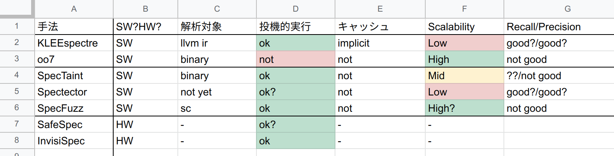

# 20211019

## 先週の予定
- [ ] 関連研究の整理および調査
  - [x] 表の作成(まだ追加が必要)
  - [x] limitation の整理
  - [ ] 実験データセット
<!-- - [ ] kleespectreの記号実行の部分を再確認 -->
<!--   - property2が怪しい -->
<!--   - が、実装の方は大丈夫っぽい -->
- [ ] kleespectre の再現
  - [ ] オリジナル検体
    - [ ] 作成
    - [ ] テスト
- [ ] Spectre論文
  -[x] abst と conclusion

追加
- SpecTaint[NDSS'21]
  - abst, conclusion, とアルゴリズムの全体像

## 研究課題

```
void victim_fucntion(size_t user_input)
{
  ...
    if (user_input < get_len(array1)) {  // VB
      secret = array1[user_input];       // RS
      temp &= array2[secret * 256];      // LS
    }
}

int main()
{
  victim_fucntion(user_input);
  return 0;
}
```

## 調査

### 関連研究の整理(表の作成)

- [SpreadSheet](https://docs.google.com/spreadsheets/d/1gMd3cJuJoKmvqdo0cslBIlYkgMvHiPlqocJlVkDouJQ/edit#gid=0)
- 基本的にSW的手法は
  1. 見つける
  2. 見つけたものに対して hardening


### SpecTaint[NDSS'21]の概要

アルゴリズムの概要
1. テスト(seeds)を作成
   - fuzzer, symbol execution を用いる
1. ユーザー入力をtaintする
   - user-controllable な変数を見つけるため
1. DECAF(QEMU上で動く)でemulate
   - conditional branch が来たら投機的実行を行う
     - 実行とは反対側のブランチを実行(SEWまで)
     - gadgetを見つけたら記録(patternベース, 詳細はまだ読めていない)


関連研究との比較
- Scalability と Precision/Recall のトレードオフを改善
  - Spectectre[SP'20]
    - 記号実行ベースの手法
    - 精度重視
  - SpecFuzz[USENIX'20]
    - Fuzz, compile時に投機実行側のコードを埋め込む
    - Sanitizer based な検出
    - Scalability重視

- oo7[TSE'20]
  - _静的_テイント解析ベース
  - 静的手法なため、大規模プログラムだと精度が悪い
  - この手法と比べるとfalse positive が少ない

### Spectre論文

- プロセッサについて
  - 究極的にはISAの変更が必要
    - 既存の billions のデバイスを守るためにはSW的手法が必要
  - security と performance のトレードオフ
    - 現在は後者を重視している
- 感想
  - そもそも convert channel を塞ぐ手法が欲しい(が、これはHW的にやらないと厳しいか)

## 手法の検討

- 既存手法は Scalabilityと精度のトレードオフが厳しい
  - トレードオフを平たくする手法(SpecTaint)

考えている手法
- SpecTaint の手法に cache モデルを導入したらどうなるのかは気になる
- Kleespectre の記号実行の改善
  - 枝刈り
    - user controllable な 変数のOut-of-boundに対してのみ対象にするとか
    - そもそも taint 解析も重いか..?

## 効果・結果

## 今後の予定

- SpecTaintを最後まで読む
- まだ全体像をつかめていないので調査が必要と感じている
  - kleespectreの関連研究にあった、cacheの(implicit/explicit)なモデル化に関する文献の調査??
  - 以下は直近で読む予定
    - [Abstract Interpretation](https://dl.acm.org/doi/10.1145/3314221.3314647)
      - 抽象解釈の手法
    - [Constant-Time for the New Era](https://www.ndss-symposium.org/ndss-paper/spectaint-speculative-taint-analysis-for-discovering-spectre-gadgets/)
      - 記号実行系の手法
    - [Automatically eliminating speculative leaks from cryptographic code with blade](https://dl.acm.org/doi/10.1145/3434330)
      - 型に基づく手法
- Kleespectreを引き続き動かしてみる

### 関連研究

Cache系の関連研究
- [CacheQuery](https://dl.acm.org/doi/abs/10.1145/3385412.3386008)[PLDI'20]
- [Theory and Practice of Finding Eviction Sets](https://ieeexplore.ieee.org/document/8835261)[SP'19]
