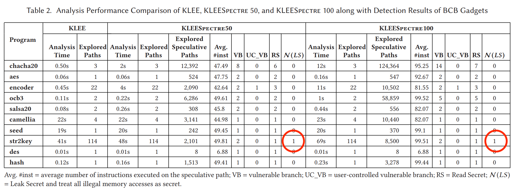
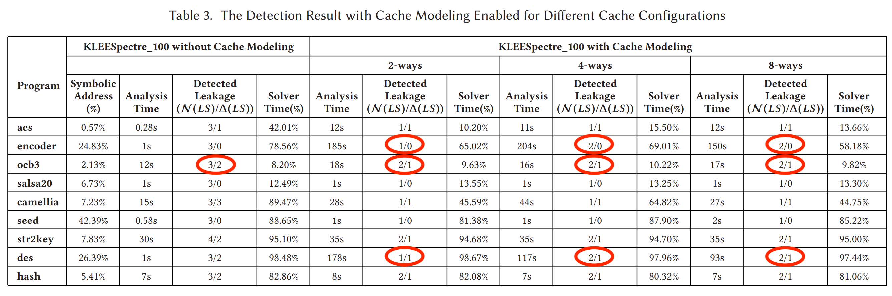

# kleespectre

# 発表

## 概要

Spectre攻撃(cache経由)によるデータ流出を記号実行を用いて検出する手法の提案。

投機的実行を記号実行で扱えるようにし、さらにキャッシュの挙動もモデル化することで、より正確にSpectre攻撃(の一種)の検出が行えるようになる。

---

## 背景知識

### 投機的実行 (Speculative execution)

- プロセッサのパフォーマンス向上の観点から、分岐命令の計算結果を計算している最中に分岐先を予測して命令を実行する。(投機的実行)
- 分岐予測が間違っていた場合、実行した命令はロールバックされる
  - 投機的実行の過程で変更されたキャッシュの状態はパフォーマンスの観点からロールバックされない。(コレがまずい)

### 記号実行

すでに輪講で扱っているので軽く。

プログラムの入力を記号として扱い、pathを探索していく過程で制約を集め、その制約を解くことによりあるpathを通るような入力を生成する手法。

### Bounds Check Bypass (BCB) Attack

Spectre攻撃の一種。

```c
if (x < array1_size) {  // VB
  y = array1[x];  // RS
  temp |= array2[y * 64];  // LS
}
```

- VB : Vulnerable Branch
- RS : Read Secret
- LS : Leak Secret

### 具体的なコードといくつかの仮定

```c
int a=100, size=16;
char array1[16];
char array2[256*64];
int victim() {
  int y=0, tmep=0;
  if (a < size) {  // VB
    y = array1[a];
    temp |= array2[y];
  }
  return temp;
}
```

- then節はdead codeだが、投機的実行によって実行され得る。(VB)
  - 実行されてキャッシュに読み出されたとしても、キャッシュのロールバックは行われない。

仮定
- 攻撃対象と攻撃者は同じマシン上にいることを仮定。(ref. [31])
- プロセッサーの分岐予測器は外部から(間違った側に)訓練(mis-train)できる。(ref. [9])
  - すべての分岐は潜在的にmis-trainedされる可能性がある。
  - よって、すべての分岐をVBとして扱うのは妥当。
- 攻撃者は access-based cache side-channel attack か trace-based cache side-channel attack を行うと仮定。(ref [38])
- 攻撃可能かどうかの判定方法
  - プログラムの実行の最後で攻撃者が secret なデータを観測できる場合に攻撃可能と判定する。
    - 何を秘密データとするかについては後述

---

## 問題設定

考察対象のコード片
```c
uint32_t SIZE = 16;
uint8_t array1[16];
array2[256*64], array3[16];

uint8_t foo(uint32_t x) {
  uint8_t temp = 0;
  if (x < SIZE) {          // b1
    temp = array1[x];      // A
    temp |= array2[temp];  // A
    if (x <= 8) {          // b2
      temp |= array2[8];   // B
    }
  }
  temp |= array3[8];       // C
  return temp;             // C
}
```


- 通常の実行を行った場合、out-of-bound access は起きない。
- (b)は従来の記号実行を行った時の execution tree
- \(c\)はこの論文でやりたいこと(以下で解説)

### 問題となる状況

- x が x >= SIZE
- b1 がmis-trained されている

以上のような場合、投機実行によって

- array1[x] が参照される。(out-of-bound reference) (temp に代入される)
- そのデータをもとにして、array2[temp]が参照される。
  - array1[x] が秘密データを参照していた場合、ここで得られる値も秘密データに依存していることになる。
  - ここで読んだ値がcacheに残っている場合、攻撃者は**間接的にarray1[x]の値を入手**してしまう。

従来の記号実行ではこのデータリークは検出できない。
これを検出するためには、

- 分岐予測による投機実行
- cache の挙動

を扱える必要がある。

---

## 提案手法の概要

- 投機的実行を考慮した記号実行
- キャッシュのモデル化

### 投機的実行を考慮した記号実行


1. **p_T1** : x < SIZE, b1 is correctly predicted.
1. **p_F1** : x >= SIZE, b1 is correctly predicted.
1. **sp_T1** : x >= SIZE, b1 is mis-predicted. (秘密情報をリークする可能性があるのはこのパターン)
1. **sp_F1** : x < SIZE, b1 is mis-predicted.

3つ目のパターンを検出したいというモチベーションがある。

が、愚直にやると検査対象の数が指数的に爆発するのでうまく工夫する必要がある。
KLEEspectreでは2つの工夫をおこなう。

1. Speculative Execution Window(SEW)による探索命令数の上限。
1. 秘密データを流出し得ない命令はメモリアクセスであっても無視する。
  - 何を秘密データとするか(詳しくは後述するが、大きく分けて2つの戦略がある)
    1. 範囲外参照先の値
    2. 外から明示的に秘密データを指定
  - 上の例で言えば、sp_T1の場合でコード片Aを実行している場合のみを考慮する。

### キャッシュのモデル化

やりたいこと：読み込んだ秘密情報がプログラム終了時点でキャッシュに残っているかを確かめたい。

KLEEspectre は cache side-channel attack の可能性のあるメモリーアクセスシークエンス(set of memory access sequences)のセットを計算する。

それぞれのシークエンスは以下のように構成されている。

- 少なくとも１つの、投機実行path上のメモリアクセス
  - secret data に関連するアクセスのみ(計算量を抑えるため)
  - 投機実行におけるデータリークにのみ興味があるため
- 複数の通常実行でのメモリアクセス

メモリアクセス単体は以下のように表せる。

- (A, x > SIZE, &array2[array1[x]])
  - &array2[array1[x]] を
  - x > SIZE という記号制約(symbolic constrain)で
  - Aのコード片から

シークエンスは以下のように表せる。

- ((A, x > SIZE, &array2[array1[x]]), (C, x > SIZE, &array3[8]))
  - この例はsp_T1, p_F1の順番で実行する例
  - sp_T1 はmis-predict

このようなシークエンスを記号実行を通して集める。

そして、以下の条件を考えることにより、プログラム実行終了時にキャッシュに秘密データが残っているかどうかを計算できる。(残っている場合にTrue)

- (x > SIZE) and (set(array2[arra1[x]]) != set(&array3[8])) or (tag(&array2[array1[x]]) = tag(&array3[8]))
  - orの前半：投機実行で秘密データをキャッシュに読み出して、かつ、かつ後続のメモリアクセスによって上書きされない。
  - orの後半：投機実行では読み出されなかったものの、&array3[8]の読み出しと一緒にキャッシュに読み出された場合。

---

## 提案手法の詳細(アルゴリズムなど)

記号実行のアルゴリズムは省略。キャッシュのモデル化のうちキーとなる考え方の部分を紹介する。

### cache の構造


この先で用いる（かもしれない）記号の定義


### Cache Conflict とは
- $r_i$, $r_j$: メモリ操作行う命令
- $\zeta _i$ ($\zeta _j$, resp.) : $r_i$ ($r_j$, resp.)を実行した直後のキャッシュの状態

$r_j$が次の場合にのみ **cache conflict** を発生させる。
- $r_j$が$r_i$の後に実行される
- $\zeta _i$と$\zeta _j$を比較し
  - $r_i$によってキャッシュに挿入されたブロックの**相対的位置**が$r_j$によって変更される


### データリーク検出

cacheに読み込んだデータがcacheに残っているかどうかを確認するためには以下の4つの状況を考える必要がある。


- (a) : conflict について
- (b) : 数える conflict は unique である必要がある(= conflict は重複する可能性がある)
- \(c\) : 無効化される conflict は数えない
- (d) : unique conflict の回数が cache の associativity を超える場合、LRUに従って secret data は cache から追い出される


**(上の条件を満たす)unique conflict の回数 < associativity** の場合、secret data は cache に残っていることになる。

<!-- これらの条件を定式化することによって、cache の挙動を（より正確に）追うことができる。 -->

### 定式化

#### 準備
- $\operatorname{set}\left(r_{i}\right)=\left(\sigma_{i} \gg B\right) \&\left(2^{S}-1\right)$
- $\operatorname{tag}\left(r_{i}\right)=\sigma_{i} \gg(B+S)$

#### $r_j$が$r_i$に対してconflictする条件(a)
- $\psi_{c n f}\left(r_{i}, r_{j}\right) \equiv\left(\operatorname{set}\left(r_{i}\right)=\operatorname{set}\left(r_{j}\right)\right) \wedge\left(\operatorname{tag}\left(r_{i}\right) \neq \operatorname{tag}\left(r_{j}\right)\right)$

#### $r_j$がuniqueなconflictである条件(b)
- $\psi_{\text {unq }}\left(r_{j}\right) \equiv \bigwedge_{k \in(j, N] \wedge r_{k} \in N_{t}}\left(\operatorname{set}\left(r_{j}\right) \neq \operatorname{set}\left(r_{k}\right)\right) \vee\left(\operatorname{tag}\left(r_{j}\right) \neq \operatorname{tag}\left(r_{k}\right)\right)$
  - $N_t$: 通常実行でのメモリ関連の命令の集合
  - 後続の$r_k \in N_t$が$r_j$と
    - setが異なるか
    - setが同じだったとしてもtagが異なる

#### $r_j$の後に再び$r_i$が読まれない条件\(c\)
- $\psi_{r e l}\left(r_{i}, r_{j}\right) \equiv \bigwedge_{k \in(j, N]}\left(\operatorname{set}\left(r_{i}\right) \neq \operatorname{set}\left(r_{k}\right)\right) \vee\left(\operatorname{tag}\left(r_{i}\right) \neq \operatorname{tag}\left(r_{k}\right)\right)$

#### まとめ
上記をまとめ、「$r_i$で読んだメモリブロックの位置が$r_j$によって変更され、それが実行の最後まで打ち消されない」は以下の$cnf_{i, j}$によって判定可能
- $\Theta_{j, i}^{+} \equiv \psi_{c n f}\left(r_{i}, r_{j}\right) \wedge \psi_{u n q}\left(r_{j}\right) \wedge \psi_{r e l}\left(r_{i}, r_{j}\right) \Rightarrow\left(c n f_{i, j}=1\right)$
- $\Theta_{j, i}^{-} \equiv \neg \psi_{c n f}\left(r_{i}, r_{j}\right) \vee \neg \psi_{u n q}\left(r_{j}\right) \vee \neg \psi_{r e l}\left(r_{i}, r_{j}\right) \Rightarrow\left(c n f_{i, j}=0\right)$

最終的に$r_i$で読んだメモリブロックに対してSpectre攻撃が可能かどうかは、以下の$\operatorname{spec}_i$によって判定可能
- $\lambda_{i} \equiv\left(\sum_{j \in[i+1, N] \wedge r_{j} \in N_{t}} c n f_{i, j}<\mathcal{A}\right) \Rightarrow \operatorname{spec}_{i}$
  - $\mathcal{A}$ : set associativity

まとめると、以下のモデルを使うことによりSpectre攻撃の可能性について考察することができる。
- $\Gamma_{\text {spectre }} \equiv \bigwedge_{r_{i} \in N_{s}}\left(\lambda_{i} \wedge\left(\bigwedge_{j \in[i+1, N] \wedge r_{j} \in N_{t}} \Theta_{j, i}^{+} \wedge \Theta_{j, i}^{-}\right)\right) \wedge\left(\sum_{r_{i} \in N_{s}} \operatorname{spec}_{i}\right)$
  - $\Gamma_{\text {spectre }}$がTrueかつその時に限りSpectre攻撃が可能

---

## 実装
pass

- KLEE をベースとしている(名前の通り)
  - symbolic execution engine
- LLVM 6.0 で生成された LLVM bitcodeを食わせる
- プログラムが外部関数を使う場合は、KLEE-uClibc とリンクさせた上で使う。
- SMT solver として STP を使う。
  - path制約
  - cache の挙動

---

## 実験

### Research Questions

- **RQ1**. Can KLEEspectre effectively detect various kinds of BCB vulnerabilities?
- **RQ2**. How efficient is KLEEspectre in detecting the BCB vulnerabilities?
- **RQ3**. How effective is out cache model in detecting cache side-channel leakage though speculative paths?

### Litmus test (RQ1, RQ3)

Kocher[28]によって作られたテストプログラムで実験を行う。
- 15個すべてのプログラムにおいて、脆弱性を検出できた。
  - Microsoft compiler は2つしか検出できなかった。

> - RQ1. Can KLEEspectre effectively detect various kinds of BCB vulnerabilities?

Yes.

だが、このテストプログラムは secret data へのアクセスの後にノーマルのメモリアクセスがないため、提案している **cache model の効果を検証できない**。

そこで、追加のテストを行った。使用するプログラムは以下。

```c
int array1_size = 16;
char array1[16];
char array2[256 * 64];
char array3[512 * 64];
char temp = 0;
char victim_fun(ind idx) {
  register int i;
  if (idx < array1_size) {
    temp &= array2[array1[idx]];  // RS
  }
#define ITER N
  for (i = 0; i < ITER; i++) {
    temp &= array3[i * 64];       // キャッシュを上書きしていく
  }
  return temp;
}
void main() {
  int x;
  klee_make_symbolic(&x, sizeof(x), "x");
  victim_fun(x);
}
```

ここで仮定するキャッシュは
- 32KiB
- set-associative
- LRU replacement policy
- each cache line -> 64 bytes of data

図に書くと以下。


また、array2のキャッシュは1番目のsetに保存されるとする。

#### 実験内容

以下を変えて実験
- cache の associativity (2-way, 4-way, 8-way)
- iteration の数

#### 実験結果


2-wayの場合で考える。
array1[idx]はcharなので1B(8bit)。
そのうち下位6bitはブロックオフセットとして使われるので、setの選択に有効な(=indexに影響する)のは、上位2bit。

したがって、array2のキャッシュが入りうるsetは4つに絞られる。
array2のキャッシュは0番目に入るという仮定があったので、結局最初の4つに格納される。

その4つを上書きするのに必要なiterationは256+4=260。
図を見ると、260で Leakage free になっていることがわかる。

> How effective is out cache model in detecting cache side-channel leakage though speculative paths?

cacheの動作を考慮してSpectre攻撃の可能性を見つけられる。

### BCB Gadgets in Real Program

#### 使用するプログラム


#### 実験設定

SEW=50, 100 のそれぞれで実験を行った。

#### 実験結果


str2keyで一つの脆弱性を発見した。以下のようなもの。

```c
void DES_set_odd_parity(DES_cblock *key) {
  int i;
  for (i = 0;, i < DES_KEY_SZ; i++) {   // VB
    (*key)[i] = odd_parity[(*key)[i]];  // RS, LS
  }
}
```

**ほとんどのプログラムでSpectre脆弱性は発見されなかった。**
ので、、、

### Leakage Detection with Cache Modeling

現実のプログラムでは脆弱性がほとんど見つからないので、人為的に脆弱性を仕込んだ上で実験を行う。
具体的には、ある特定のコードをstart, middle, endに入れる。

#### 実験結果


- N(LS) : leakage of potentially secret data
- delta(LS) : leakage of user-marked secret

Litmus testと上の表より、RQ3に対して以下のことが言える。
> - RQ3. How effective is out cache model in detecting cache side-channel leakage though speculative paths?

- cache modelを導入することにより、検出件数が減る(ocb3)
  - **false positive を削っている。**
  - 実際はcacheは上書きされるが、cacheの挙動がわからないが故に、false positiveを作っている。
- associativity を上げると、検出数が増える。
  - associativityを上げることによって、キャッシュから追い出されづらくなる。
  - **cache の挙動の正確な再現**

### 007との比較(RQ2)

2つのプログラムに対して実験を行った。
- `trie` from the `freeadius`
  - 1h程度
  - with cache : 1
  - without cache : 1
- `touch` from `coreutils`
  - 12h程度
  - with cache : 1
  - without cache : 1

> - RQ2. How efficient is KLEEspectre in detecting the BCB vulnerabilities?

efficient?

---

## 課題

- Path Explosion
  - 通常の記号実行よりも多くpathを探索する。(SEWによって実行する命令は限られている。)
  - スケールしない(しにくい)
  - 簡単な静的解析を始めにやっておくことで、探索するpathを減らすという手法は使える。
- Precise Modeling of Program Behavior
  - 生のbinaryを扱わないので、プログラムの挙動が正確ではない可能性がある(compiler optimization)
  - KLEEspectreはsoundにやるので、false positiveが多くなる。
- Explicit Modeling of Cache
  - explicit にcacheをモデル化することで、さらなる解析が可能になる
  - が、setやassociativityなど、外から与えるparameterが必要で、コレをミスすると解析にfalse (positive/negative)が増える。
- The Setting of Speculative Execution Window (SEW)
  - SEWを不正確に設定すると、解析の結果も不正確になる。
  - 通常は Reorder Buffer(RoB) と同等程度のSEWを設定する。

---

## 関連研究

### Spectre攻撃に対するハードウェアからのアプローチ

- cache ではなく Speculative Buffer(SB) を使ってデータをロードし、ロールバックする場合はSBをスカッシュする手法(InvisiSpec, [44])
- cache で"Undo"を行う手法(CleanupSpec, InvisiSpecの改良版, [39])
- cacheを撹乱してsensitibe dataのleakを防ぐ手法(CEASER [37], ScatterCache[42])

上記手法はハードウェアに大きく依存している。
KLEEspectreは、分岐予測をもとに投機的実行を行う任意のプロセッサの上で動く任意のアプリケーションを対象にできる。

### Spectre攻撃に対するソフトウェアからのアプローチ

- コンパイル時点でVBを発見し、データリークの可能性のあるpointerを無効化するコードを挿入する手法(RSを消す手法)(Speculative Load Hardening(SLH), [10])
  - 実行時オーバーヘッドが無視できない程度に増加する(36%程度)
- potentially vulnerable な命令の実行を遅らせることで、投機的実行を回避する手法([33])
  - 上記の手法と同様、実行時オーバーヘッドがひどい
    - "potentially" vulnerable な命令すべてに対して遅延を導入するため

KLEEspectreと併用することによって、実行時のオーバーヘッドを削減することができる。

- Microsoft Visual C/C++ コンパイラ[15]
  - オプションで"lfence"と呼ばれるコードを挿入することで防御をしているが、2/15しか防げていない(Spectre litmus test)。
- 静的解析によって投機的実行をモデル化する手法(草分け的論文?)。(007, TSE'20)
  - conservative static analysis 由来のfalse positiveが顕著
  - KLEEspectreのほうが優れている（らしい）

### Speculative Semantics and Formal Models

モデル検査

- Trace property-dependent observational determinism(TPOD) というセキュリティに関する性質を用いる手法([13])
  - この論文では実装はないらしい
  - arahori-sanリスト5
    - モデル検査による解析
- 投機的評価をモデル化するmicroarchitecturalなモデル([16])
- model for constant-time programming([11])
  - constant-time programming??
  - arahori-sanリスト2
- out-of-order実行をモデル化するためのインフラ提供(InSpectre, [6])
  - microarchitectural featuresのsemanticsを考察
- 投機的実行に対してfuzz testを実行することによりSpectre脆弱性を検出する(SpecFuzz, [34])
  - cacheのモデル化は行っていない。
- speculative noninterference?を用いた記号実行(SPECTECTOR, [23])

上記の手法は、speculative semantics のモデル化し、プログラム解析における脆弱性を定義しているものの、cache side-channel攻撃のモデル化とチェックは行っていない。
KLEEspectreはcacheのモデル化を行うことにより達成している。

### Side-Channel Analysis without Cache Modeling

- キャッシュの明示的なモデル化を行わないので、false positiveが多い。
- 投機的実行をモデル化しないので、Spectre攻撃を検出できない。

### Side-Channel Attack Identification via Cache Modeling

---

## 結論

- KLEEspectre という新しいテストツールの提案
  - 投機的実行やキャッシュ(microarchitectural features)を扱うことができる記号実行のフレームワーク(?)
  - hardware でプログラムを動かす際のmicroarchitectural features由来の脆弱性を検出できるようになる
  - 実際にBCB vulnerability を見つけるとこができる。
    - cacheモデルによって、false positive が少ない。
- microarchitetural features 由来の脆弱性に関するテストの範囲を広げた

---

## 関連研究の調査計画

arahori-sanリストを中心に調査を進めていく。

> 1. 抽象解釈に基づく解析[PLDI'19]: https://dl.acm.org/doi/10.1145/3314221.3314647
> 1. 記号実行に基づく解析（KLEESpectre以外）[PLDI'20]: https://dl.acm.org/doi/abs/10.1145/3385412.3385970
> 1. テイント解析に基づく解析[NDSS'21]: https://www.ndss-symposium.org/ndss-paper/spectaint-speculative-taint-analysis-for-discovering-spectre-gadgets/
> 1. 型システムに基づく解析[POPL'21]: https://dl.acm.org/doi/10.1145/3434330
> 1. モデル検査に基づく解析[CSF'19]: https://ieeexplore.ieee.org/document/882373

1. Side-channel attacksのサーベイ論文: https://dl.acm.org/doi/10.1145/3456629

---

## TODO

1. KLEEspectreの読めていない部分を読む。
  1. 加えて、最新の状況の調査も行いたい。→ 論文調査
  1. arahori-san リスト?
1. 卒論テーマの問題定義
   - まだ調査が必要
1. KLEEspectreの再現実験
   - KLEEspectre自体は公開されている。
