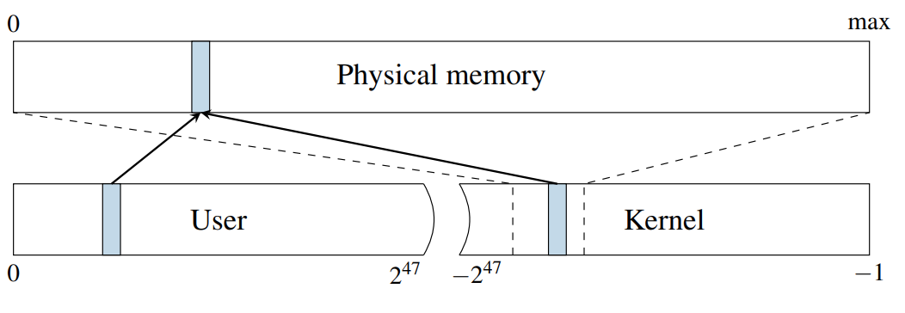
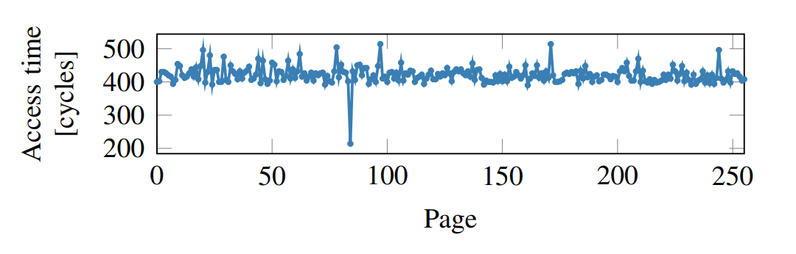

# Meltdown

> Meltdown breaks all security guarantee provided by address space isolation as well as paravirtualized environments.

対策としてpage-tableを分離することが考えられる。
- KAISER
  - (Kernel Address Isolation to have Side-channel Effectively Removed)
- KPTI(こっちで呼ばれることのほうが多い)
  - (Kernel Page-Table Isolation)
- もともとはKASLRという、メモリランダマイズが突破されたための対策の実装が存在していた。
  - ASLR: メモリランダマイズの研究

## メモリ空間について



- Kernel空間に Physical Memory 全体がmapされている(!!)
  - kernelは user page に対する操作も行う必要がある

## A Toy Example

```
raise_exception();
// the line below is never reached
access(probe_array[data * 4096]);
```

- OoO実行により、次の命令をすでに実行している可能性がある。
  - データ依存関係は無
- This OoO execution have microarchitectural side effect.
- このOoO実行により、命令自体はスカッシュされるが、キャッシュの状態はそのまま
- Flush+Reload という攻撃手法でどこにキャッシュされたかがわかる。

### Flush+Reload

1. cacheを**flush**しておく。
1. OoO実行
1. すべての page にアクセス。
1. 早くアクセスできるところはキャッシュされているところ。
1. OoO実行でアクセスしたところの特定。



どうやら84番目のページにアクセスしたらしい。
